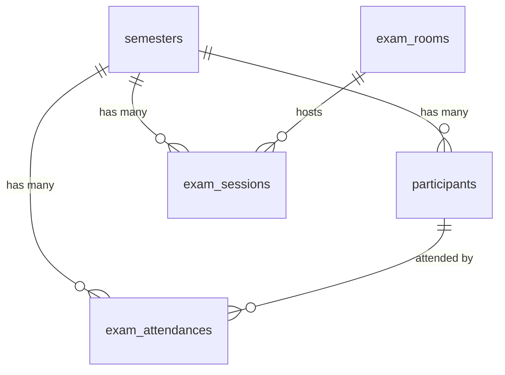

# SIDA Pasca ULM

**Sistem Informasi & Data Admisi Program Pascasarjana Universitas Lambung Mangkurat**


---

## 📖 Overview

SIDA Pasca ULM is a comprehensive web-based application designed to manage the admission process for the Postgraduate Program at Universitas Lambung Mangkurat. The system handles applicant data management, document verification, payment tracking, exam scheduling, attendance management, and exam card generation.

**Live Environment:** `http://pmb-pps-ulm.test`  
**Timezone:** Asia/Makassar (WITA / UTC+8)  
**Current Version:** v1.2.0 (Production)

---

## 🚀 Key Features

### Admin Features
- **📊 Dashboard Monitoring**: Real-time statistics of admission data per program
- **👥 Participant Management**: Complete CRUD operations with advanced filtering
- **📥 Excel Import**: Bulk import for registration, status updates, and payment data
- **📤 Excel Export**: Detailed recapitulation of particpant data (biodata, education, docs)
- **✅ Document Verification**: Physical document verification workflow with checklist
- **🏛️ Exam Room Management**: Configure exam rooms with capacity management
- **📅 Exam Scheduling**: Assign participants to exam sessions and rooms
- **📝 Attendance Tracking**: Record and manage exam attendance
- **📧 Email Reminder System**: Send mass notifications with template builder (SMTP & Google Apps Script)
- **🎫 CAT Schedule**: Print exam schedules for posting at room entrances
- **📄 Dynamic PDF Generator**: Cards & Forms with configurable letterhead & single-page layout
- **⚙️ System Settings**: Configurable branding (logo, favicon, app name, letterheads)
- **💾 Database Tools**: Backup, restore, and semester-based data cleanup

### Participant Features
- **🔐 Secure Login**: Email + date of birth authentication
- **📄 Status Checking**: View application status and payment information
- **🎫 Exam Card Download**: Generate and download personalized exam cards (PDF)
- **📱 Responsive Interface**: Mobile-friendly participant portal

### Technical Features
- **🔄 Multi-semester Support**: Manage multiple admission periods
- **💳 Payment Tracking**: Transaction ID, payment date, and method recording
- **📎 Document Management**: Upload and manage applicant documents (KTP, Ijazah, Transkrip, Photo)
- **🎨 Customizable Templates**: Dynamic exam card & form templates with HTML support
- **🔒 Security**: bcrypt password hashing, SQL injection protection, session-based auth

---

## 🛠️ Technology Stack

### Backend & Core
| Component | Technology | Version | Purpose |
|-----------|------------|---------|---------|
| **Language** | PHP | 8.1+ | Core language |
| **Framework** | Leaf PHP | v3.0 | MVC framework |
| **Templating** | Leaf Blade | v2.0 | View rendering |
| **Database** | SQLite / MySQL | 3.x / 8.x | Data storage |
| **Authentication** | Leaf Auth | v2.0 | Session management |
| **Excel** | PhpSpreadsheet | v1.29 | Excel processing |
| **PDF** | DOMPDF | v2.0 | PDF generation |

### Frontend
| Component | Technology | Source | Purpose |
|-----------|------------|--------|---------|
| **CSS Framework** | Tailwind CSS | v3.x CDN | Utility-first styling |
| **UI Theme** | AdminLTE | v3.x | Admin interface |
| **Charts** | Chart.js | v4.x | Data visualization |
| **Icons** | Heroicons / FontAwesome | CDN | Icon library |

### Server Environment
- **Web Server**: Apache (Laragon/XAMPP)
- **Rewrite**: `.htaccess` (Leaf standard routing)
- **Database Primary**: SQLite (`storage/database.sqlite`)

---

## ⚙️ Requirements

### System Requirements
- **PHP**: ^8.1 or higher
- **Web Server**: Apache with mod_rewrite
- **Composer**: Latest stable version

### Required PHP Extensions
```
pdo_sqlite (or pdo_mysql for MySQL)
fileinfo
gd
zip
json
mbstring
openssl
```

### Recommended
- PHP Memory Limit: >= 256M
- Max Upload Size: >= 10M
- Execution Time: >= 300 seconds (for large imports)

---

## 📥 Installation

### 1. Clone the Repository
```bash
git clone https://github.com/your-repo/sida-pasca-ulm.git
cd sida-pasca-ulm
```

### 2. Install Dependencies
```bash
composer install
```

### 3. Environment Setup
Copy the example environment file:
```bash
cp .env.example .env
```

Edit `.env` for your database configuration:
```env
DB_CONNECTION=sqlite
DB_SQLITE_PATH=storage/database.sqlite
```

### 4. Database Migration & Seeding
Run the migration scripts to set up the database:
```bash
# Create all tables and schema
php app/database/migrations/migrate.php

# Seed default settings and admin user
php app/database/migrations/seed.php
```

### 5. Set Permissions
```bash
# Linux/Mac
chmod -R 755 storage/
chmod 666 storage/database.sqlite

# Windows (run as administrator)
icacls storage /grant Users:F /T
```

### 6. Serve the Application

**Option A: Laragon/XAMPP**
- Point virtual host to project root
- Access via `http://pmb-pps-ulm.test`

**Option B: PHP Built-in Server**
```bash
php -S localhost:8000
```

**Option C: Apache Virtual Host**
```apache
<VirtualHost *:80>
    DocumentRoot "path/to/pmb-pps-ulm"
    ServerName pmb-pps-ulm.test
    <Directory "path/to/pmb-pps-ulm">
        AllowOverride All
        Require all granted
    </Directory>
</VirtualHost>
```

---

## 📂 Project Structure

```
pmb-pps-ulm/
├── app/
│   ├── controllers/          # Application logic (25 controllers)
│   │   ├── AdminController.php
│   │   ├── ParticipantController.php
│   │   ├── ImportController.php
│   │   └── ...
│   ├── models/               # Database models (10 models)
│   │   ├── User.php
│   │   ├── Participant.php
│   │   ├── Semester.php
│   │   └── ...
│   ├── utils/                # Helper utilities
│   │   ├── Database.php      # PDO connection manager
│   │   ├── View.php          # Blade renderer
│   │   └── SimpleCaptcha.php # Math captcha generator
│   ├── views/                # Blade templates (32+ views)
│   │   ├── admin/            # Admin interface
│   │   ├── participant/      # Participant portal
│   │   └── layouts/          # Layout templates
│   └── database/
│       └── migrations/       # Database migrations
│           ├── migrate.php   # Schema creation
│           └── seed.php      # Data seeding
├── config/                   # Configuration files
├── public/                   # Static assets
│   └── css/                  # Custom stylesheets
├── storage/                  # Application data
│   ├── assets/               # Uploaded logos/favicons
│   ├── database.sqlite       # Main SQLite database
│   ├── documents/            # Applicant documents (KTP, Ijazah, Transkrip)
│   └── photos/               # Applicant photos
├── vendor/                   # Composer dependencies
├── .env                      # Environment configuration
├── .htaccess                 # Apache rewrite rules
├── index.php                 # Application entry point
├── composer.json             # Dependency definitions
├── CHANGELOG.md              # Version history
└── README.md                 # This file
```

---

## 💾 Database Architecture

The system uses **17 main tables** in a **semester-centric architecture**:



### Core Tables
- **users**: Admin authentication with role-based access
- **semesters**: Academic period management
- **participants**: Main entity (58+ fields for comprehensive applicant data)
- **exam_rooms**: Exam room master data
- **exam_sessions**: Exam scheduling
- **exam_attendances**: Attendance tracking
- **settings**: System configuration (key-value pairs)
- **email_configurations**: SMTP email settings
- **email_templates**: Reusable email templates with placeholders
- **email_reminders**: Reminder batch tracking
- **email_logs**: Individual email delivery logs
- **document_verifications**: Physical document verification status

> **📊 For detailed database documentation with complete field descriptions and relationships, see:**
> - [Database ERD Documentation](https://github.com/your-repo/docs/database_erd.md)

---

## 🔐 Default Credentials

### Admin Access
- **URL**: `/admin/login`

| Username | Password | Role | Access |
|----------|----------|------|--------|
| `admin` | `admin123` | Superadmin | Full access |
| `operator` | `operator123` | Admin | Standard admin |
| `upkh` | `upkh123` | UPKH | Document verification |
| `tu` | `tu123` | TU | Scheduling & reports |
| `prodi_test` | `prodi123` | Admin Prodi | Program-specific |

> ⚠️ **IMPORTANT**: Change default passwords immediately after first login!

### Role-Based Access Control (RBAC)

The system implements 5 distinct user roles:

| Role | Description | Key Permissions |
|------|-------------|----------------|
| **Superadmin** | Full system access | User management, all settings, all features |
| **Admin** | Standard administrator | CRUD, import/export, settings, verification |
| **UPKH** | Document verification officer | View participants, verify documents |
| **TU** | Academic administration | Scheduling, attendance, reports, printing |
| **Admin Prodi** | Program administrator | View/manage own program data only |

### Participant Access
- **URL**: `/login`
- **Email**: *(As registered/imported)*
- **Password**: Date of Birth in format `YYYY-MM-DD` (e.g., `1995-08-15`)

---

## 📚 Documentation

### Primary Documentation
  - System architecture and design patterns
  - API reference and coding standards
  - Database schema details
  - Import/Export workflows
  - Troubleshooting guide

### Additional Resources
- **[CHANGELOG.md](CHANGELOG.md)** - Version history and changes
- **Database ERD** - Entity Relationship Diagrams
- **Migration Files** - `app/database/migrations/`

---

## 🔧 Configuration

### Key Settings (via Admin Panel)
- **Application Name**: Customizable system title
- **Logo & Favicon**: Upload custom branding
- **Timezone**: Asia/Makassar (default)
- **Exam Card Downloads**: Enable/disable feature
- **Semester Management**: Set active admission period

### Environment Variables (.env)
```env
# Database Configuration
DB_CONNECTION=sqlite
DB_SQLITE_PATH=storage/database.sqlite

# Application Settings
APP_ENV=production
APP_DEBUG=false
```

---

## 🚀 Usage Guide

### For Administrators

1. **Import Applicant Data**
   - Navigate to Import menu
   - Upload Excel file with applicant information
   - Select import mode (Full/Update/Insert)
   - Review import results

2. **Verify Documents**
   - Go to Participants → Formulir Masuk
   - Review applicant details
   - Update status to "Lulus" or "Gagal"

3. **Schedule Exams**
   - Set up Exam Rooms (Master Data)
   - Create Exam Sessions
   - Assign participants to sessions

4. **Track Attendance**
   - Open Attendance Management
   - Mark participant attendance
   - Generate attendance reports

### For Participants

1. **Login**: Use email + date of birth
2. **Check Status**: View application status
3. **Download Exam Card**: If status is "Lulus" and payment confirmed

---

## 🔒 Security Features

- ✅ **Password Hashing**: bcrypt for admin passwords
- ✅ **SQL Injection Protection**: Prepared statements (PDO)
- ✅ **Session Security**: Secure session management
- ✅ **Input Validation**: Server-side validation for all forms
- ✅ **Captcha Protection**: Math-based captcha for login
- ✅ **File Upload Security**: Type validation and sanitization
- ✅ **XSS Protection**: Output escaping in Blade templates

### Production Security Checklist
- [ ] Change default admin password
- [ ] Remove debug files from web root
- [ ] Set proper file permissions (755 for directories, 644 for files)
- [ ] Disable PHP error display in production
- [ ] Enable HTTPS/SSL
- [ ] Regular database backups
- [ ] Monitor access logs

---

## 🐛 Troubleshooting

### Common Issues

**Database Connection Failed**
```bash
# Check SQLite extension
php -m | grep sqlite

# Check file permissions
chmod 666 storage/database.sqlite
```

**Excel Import Error**
```bash
# Verify PhpSpreadsheet installation
composer show phpoffice/phpspreadsheet
```

**PDF Generation Blank**
```bash
# Check DOMPDF installation
composer show dompdf/dompdf
```

**Login Fails**
- Verify email format (case-sensitive)
- Check date of birth format: `YYYY-MM-DD`
- Clear browser cache/cookies


---

## 📊 Development Roadmap

### Current Version: v1.2.0 ✅
- Core admission management
- Excel import/export
- Exam scheduling
- Attendance tracking
- Document management
- Email reminder system
- Role-Based Access Control (RBAC)

### Planned Features
- [ ] Activity Audit Logs
- [ ] Advanced Reporting
- [ ] RESTful API for integrations
- [ ] Multi-language support (ID/EN)

---

## 🤝 Contributing

This is proprietary software for Universitas Lambung Mangkurat. For internal contributions:

1. Create a feature branch
2. Commit changes with descriptive messages
3. Submit for code review
4. Merge after approval

---

## 📝 License

**Proprietary Software**  
© 2024-2026 Program Pascasarjana Universitas Lambung Mangkurat  
All rights reserved.

This software is the property of Universitas Lambung Mangkurat and is protected by copyright law. Unauthorized copying, distribution, or modification is prohibited.

---

## 📞 Support

**Technical Support:**
- Email: shabirin.mukhlish@ulm.ac.id
- Issues: Internal ticketing system

**Maintainer:**
- Program Pascasarjana ULM - Development Team

---

## ✨ Acknowledgments

Built with:
- [Leaf PHP](https://leafphp.dev/) - The lightweight PHP framework
- [Tailwind CSS](https://tailwindcss.com/) - Utility-first CSS framework
- [AdminLTE](https://adminlte.io/) - Admin dashboard template
- [Chart.js](https://www.chartjs.org/) - Data visualization
- [PhpSpreadsheet](https://phpspreadsheet.readthedocs.io/) - Excel processing
- [DOMPDF](https://github.com/dompdf/dompdf) - PDF generation

---

**Last Updated:** 06 Januari 2026 05:24 WITA  
**Version:** 1.2.0 (Production)  
**Status:** Active Development
