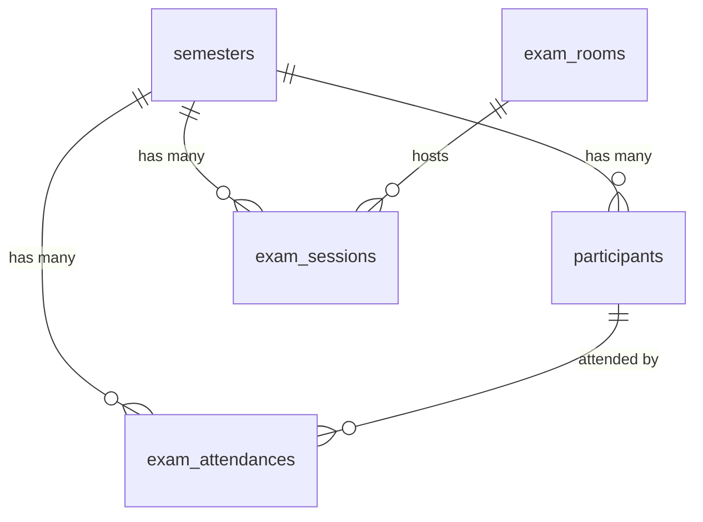
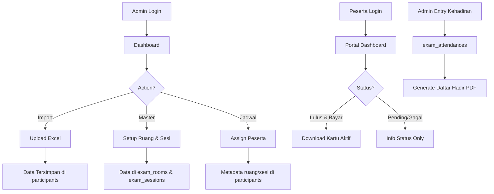

# AGENTS.MD - SIDA Pasca ULM

**Sistem Informasi & Data Admisi Program Pascasarjana Universitas Lambung Mangkurat**

---

## 🎯 SYSTEM ROLE

Anda adalah **Senior PHP Developer** yang ahli dalam **Leaf PHP** dan **Tailwind CSS**. Tugas Anda adalah membangun dan memelihara sistem pendukung untuk **admisipasca.ulm.ac.id**. 

Sistem ini berfungsi untuk:
- Mengelola data peserta admisi pascasarjana
- Visualisasi data statistik per program studi
- Pencetakan kartu ujian mandiri
- Import data dari file Excel
- Portal peserta untuk login dan download dokumen

Anda **HARUS** mematuhi stack teknologi dan aturan bisnis di bawah ini secara ketat.

---

## 📋 RINGKASAN PROYEK

| Aspek | Detail |
|-------|--------|
| **Nama Proyek** | SIDA Pasca ULM (Sistem Informasi & Data Admisi Pasca) |
| **Platform** | Web Application |
| **Host Development** | http://pmb-pps-ulm.test |
| **Timezone** | Asia/Makassar (WITA / UTC+8) |
| **Status** | Production Ready |
| **Last Updated** | 2026-01-07 03:50 WITA |

### Tujuan Sistem
Menyediakan:
1. **Dashboard Monitoring** untuk admin
2. **Import Data** dari Excel (Sistem Utama)
3. **Portal Peserta** untuk download kartu ujian
4. **Manajemen Jadwal** ruang & sesi ujian
5. **Sistem Kehadiran** ujian
6. **Email Reminder System** untuk notifikasi peserta
7. **Document Verification** untuk validasi berkas fisik
8. **Document Helper & Mass Sync** untuk manajemen dokumen peserta dari sistem legacy

---

## 🛠️ STACK TEKNOLOGI

### Backend & Core
| Komponen | Teknologi | Versi | Keterangan |
|----------|-----------|-------|------------|
| **Language** | PHP | 8.x | Required minimum |
| **Framework** | Leaf PHP | ^3.0 | MVC Pattern |
| **Templating** | Leaf Blade | ^2.0 | Blade engine |
| **Database Layer** | Leaf DB / PDO | ^2.0 | Dual driver (MySQL/SQLite) |
| **Authentication** | Leaf Auth | ^2.0 | Session-based |
| **Excel Processor** | PHPOffice/PhpSpreadsheet | ^1.29 | Parsing .xls/.xlsx |
| **PDF Generator** | DOMPDF | ^2.0 | Generate Kartu Ujian |
| **Environment** | vlucas/phpdotenv | ^5.6 | .env management |

### Frontend
| Komponen | Teknologi | Sumber | Keterangan |
|----------|-----------|--------|------------|
| **CSS Framework** | Tailwind CSS / Bootstrap 4 | v3.x / v4.6 | AdminLTE uses Bootstrap |
| **UI Theme** | AdminLTE | v3.x | Admin interface |
| **Charts** | Chart.js | v4.x | Pie & Bar charts |
| **Icons** | FontAwesome | v5.x | Icon library |
| **Interact** | SweetAlert2 | v11.x | Alerts & Confirmations |

### Server & Environment
| Komponen | Konfigurasi |
|----------|-------------|
| **Web Server** | Apache (Laragon/XAMPP) |
| **Rewrite** | .htaccess (Leaf Standard) |
| **Database** | SQLite (Primary) / MySQL (Switchable) |
| **SQLite Path** | `storage/database.sqlite` |

---

## 💾 DATABASE ARCHITECTURE

> [!NOTE]
> **Comprehensive ERD Available:** For detailed Entity Relationship Diagrams with visual representations, see [`database.md`](database.md)

### Database Overview

The SIDA Pasca ULM uses **SQLite** (primary) with MySQL fallback support. The database consists of **17 main tables** organized in a **semester-centric architecture**.

**Quick ERD:**


### Skema Database (Normalized 3NF)

#### 1. Tabel `users` (Admin)
```sql
CREATE TABLE users (
    id INTEGER PRIMARY KEY AUTOINCREMENT,
    username VARCHAR(255) UNIQUE NOT NULL,
    password VARCHAR(255) NOT NULL,      -- bcrypt hashed
    role VARCHAR(20) DEFAULT 'admin',    -- superadmin, admin, upkh, tu, admin_prodi
    prodi_id VARCHAR(50) NULL,           -- For admin_prodi role (links to kode_prodi)
    created_at DATETIME DEFAULT CURRENT_TIMESTAMP,
    updated_at DATETIME DEFAULT CURRENT_TIMESTAMP
);
```

#### 2. Tabel `participants` (Data Peserta - Main Entity)
See `database.md` for full schema. Key relations:
- `semester_id` -> `semesters.id`
- `photo_filename`, `ijazah_filename`, etc. store paths relative to storage root.

---

## ⚙️ FITUR-FITUR SISTEM

### 1. 📊 Dashboard Admin
**Route:** `GET /admin`  
**Fitur:**
- Statistik global (Total, Lulus, Gagal, Bayar)
- Grafik Distribusi Prodi (Pie Chart)

---

### 2. 🗂️ Manajemen Peserta (Grouped)

#### A. Admisi Pasca (Workflow Pendaftaran)
**Routes:** `/admin/participants?filter=...`
1.  **Formulir Masuk** (`?filter=pending`)
    - Menampilkan pendaftar baru yang perlu diverifikasi.
2.  **Lulus Berkas** (`?filter=lulus`)
    - Menampilkan peserta yang lolos seleksi berkas.

#### B. Document Helper (NEW)
**Route:** `/admin/document-helper`
- **Purpose**: Manage and verify participant documents efficiently.
- **Features**:
  - **Inline Preview**: Zoom, Pan, Rotate images/PDFs within modal.
  - **Mass Sync**: Sync documents from legacy server for all filtered participants.
  - **Inline Import**: Upload/replace ZIP documents without reloading.
  - **Status Indicators**: Green (Complete) / Grey (Missing) indicators on tabs.
- **Technical**:
  - `massSyncAll()`: Async function iterating through participants.
  - `length=-1`: API parameter to fetch all records for sync.
  - `processZipFile()`: Extractor service that handles various naming conventions.

---

### 3. 📥 Import & Export Data
**Fitur:**
- **Import Excel**: Pendaftaran Baru, Update Status (Lulus/Gagal), Import Nomor Peserta.
- **Export Data**:
  - **Rekapitulasi Excel**: Download data lengkap peserta (Biodata, Pendidikan S1/S2, Checklist Dokumen).

---

### 4. ⚙️ Settings & Branding
**Route:** `/admin/settings`
- **Branding:** Upload Logo & Favicon.
- **Naming:** Ubah Nama Aplikasi secara dinamis.
- **Backup/Restore:** SQLite database management.

---

### 5. 📧 Email Reminder System

Complete email notification system for participant communication.

#### A. Email Configuration
**Route:** `/admin/email/config`
- **SMTP Setup:** Configure email server settings
  - Host, Port, Username, Password
  - Encryption (SSL/TLS/None)
  - From Email & Name
- **Google Apps Script (GAS) Driver:**
  - Alternative email sending method via Webhook
  - Bypasses local SMTP restrictions
  - configured via Script URL
- **Test Connection:** Send test email to verify configuration
- **Secure Storage:** Credentials encrypted in database

#### B. Email Templates
**Route:** `/admin/email/templates`
- **Template Management:** Create, edit, delete email templates
- **Rich Text Editor:** Summernote WYSIWYG editor
- **Dynamic Placeholders:** 
  - `{nama}` - Participant name
  - `{nomor_peserta}` - Exam number
  - `{prodi}` - Study program
  - `{email}` - Email address
  - `{no_hp}` - Phone number
- **Preview:** Test template with sample data

#### C. Send Reminders
**Route:** `/admin/email/reminders/send`
- **Recipient Filtering:**
  - By semester
  - By study program
  - By status (Lulus/Pending/All)
- **Preview List:** See who will receive emails
- **Template Selection:** Choose from saved templates
- **Batch Sending:** Queue management for large lists
- **Success Tracking:** Monitor delivery status

#### D. Reminder History
**Route:** `/admin/email/reminders`
- **View All Sent:** Complete audit trail
- **Detailed Logs:** Click to see recipient list
- **Delivery Status:** Success/failure tracking
- **Sent By:** Admin who sent the reminder

---

### 6. ✅ Document Verification Module

Physical document verification workflow for exam card download control.

#### A. Verification List
**Route:** `/admin/verification/physical`
- **All Participants:** View verification status for all
- **Progress Indicator:** X of 4/6 documents verified
- **Status Icons:** Visual feedback (✓ verified, ✗ pending)
- **Quick Actions:** Direct link to verification page

#### B. Verification Detail
**Route:** `/admin/verification/physical/{id}`
- **Document Checklist:**
  - Photo (Pas foto)
  - KTP (ID Card)
  - Ijazah S1 (Bachelor's Diploma)
  - Transkrip S1 (Bachelor's Transcript)
  - Ijazah S2 (Master's Diploma - for S3)
  - Transkrip S2 (Master's Transcript - for S3)
- **Checkbox Interface:** Mark as verified/unverified
- **Auto Save:** Real-time updates
- **Reset Function:** Clear all verifications
- **Bypass Option:** Allow download even if incomplete

#### C. Excel Import
**Route:** `/admin/verification/physical/import`
- **Download Template:** Excel with participant list
- **Batch Update:** Import verification status
- **Column Mapping:** Participant ID + 6 document columns
- **Validation:** Error handling for invalid data

#### D. Integration
- **Exam Card Download:** Blocked until verification complete
- **Error Messages:** Clear feedback when incomplete
- **Bypass Cases:** Admin can override for special situations
- **Automatic Counting:** Verified count auto-calculated

---

### 7. 📅 CAT Schedule

**Route:** `/admin/cat-schedule`

Print-ready exam schedule for posting at exam room entrances.

**Features:**
- Filter by exam session and room
- A4 format with letterhead
- 4-column table (NO, NOMOR PESERTA, NAMA, PRODI)
- No signature fields (vs Daftar Hadir)
- Print button for direct printing


---

## 🔐 KEAMANAN & AUTHENTICATION

### Admin Authentication
**System:** Session-based with Role-Based Access Control (RBAC)
```php
// Login check with role
if (!isset($_SESSION['admin'])) {
    // Redirect to login
}

// Role check example
if (!\App\Utils\RoleHelper::canManageSettings()) {
    response()->redirect('/admin?error=unauthorized');
}
```

**RoleHelper Utility (`app/Utils/RoleHelper.php`):**
```php
// Role constants
const ROLE_SUPERADMIN = 'superadmin';
const ROLE_ADMIN = 'admin';
const ROLE_UPKH = 'upkh';
const ROLE_TU = 'tu';
const ROLE_ADMIN_PRODI = 'admin_prodi';

// Permission methods
RoleHelper::canEditParticipant();     // Superadmin, Admin, UPKH
RoleHelper::canValidatePhysical();    // Superadmin, Admin, UPKH
RoleHelper::canManageSchedule();      // Superadmin, Admin, TU
RoleHelper::canManageUsers();         // Superadmin only
RoleHelper::canImportExport();        // Superadmin, Admin
RoleHelper::canManageSettings();      // Superadmin, Admin
```

**Role Permission Matrix:**
| Permission | Superadmin | Admin | UPKH | TU | Admin Prodi |
|------------|:----------:|:-----:|:----:|:--:|:-----------:|
| canEditParticipant | ✓ | ✓ | ✓ | ✗ | ✗ |
| canValidatePhysical | ✓ | ✓ | ✓ | ✗ | ✗ |
| canManageSchedule | ✓ | ✓ | ✗ | ✓ | ✗ |
| canManageUsers | ✓ | ✗ | ✗ | ✗ | ✗ |
| canImportExport | ✓ | ✓ | ✗ | ✗ | ✗ |
| canManageSettings | ✓ | ✓ | ✗ | ✗ | ✗ |
| canManageEmail | ✓ | ✓ | ✗ | ✓ | ✗ |
| canPrintCards | ✓ | ✓ | ✗ | ✓ | ✗ |
| canViewReports | ✓ | ✓ | ✗ | ✓ | ✓ |
| canDownloadDocuments | ✓ | ✓ | ✓ | ✗ | ✓ |

### Participant Authentication
**System:** Session-based tanpa password storage
```php
// Login validation
$email = input('email');
$tgl_lahir = input('tgl_lahir'); // Format: YYYY-MM-DD

// Query database
$participant = Participant::where('email', $email)
    ->where('tgl_lahir', $tgl_lahir)
    ->first();

if ($participant) {
    $_SESSION['user'] = $participant['id'];
}
```

### Security Best Practices
✅ **SQL Injection Protection:** Prepared Statements (PDO Binding)  
✅ **Password Hashing:** bcrypt untuk admin  
✅ **Input Sanitization:** Excel import data di-sanitize sebelum insert  
✅ **Captcha:** Anti-bot sederhana tapi efektif  
✅ **Error Handling:** User-friendly messages, stack trace hidden di public  

---

## 🎨 FRONTEND GUIDELINES

### Tailwind CSS
**CDN Usage:**
```html
<script src="https://cdn.tailwindcss.com"></script>
```

**Best Practices:**
- ❌ Hindari inline styles `style="..."`
- ✅ Gunakan utility classes: `flex`, `grid`, `bg-blue-500`, `text-white`
- ✅ Responsive: `sm:`, `md:`, `lg:` breakpoints
- ✅ Untuk tabel panjang: `overflow-x-auto` wrapper

**Component Reusability:**
```blade
{{-- Blade Component Example --}}
@component('components.button', ['variant' => 'primary'])
    Submit
@endcomponent
```

### Chart.js Implementation
**Dashboard Admin:**
```javascript
// Pie Chart - Distribusi per Prodi
const ctx = document.getElementById('prodiChart').getContext('2d');
new Chart(ctx, {
    type: 'pie',
    data: {
        labels: @json($prodiLabels),
        datasets: [{
            data: @json($prodiData),
            backgroundColor: ['#FF6384', '#36A2EB', '#FFCE56', ...]
        }]
    }
});
```

### Icons
**Heroicons (Recommended):**
```html
<svg class="w-6 h-6" fill="none" stroke="currentColor" viewBox="0 0 24 24">
    <path stroke-linecap="round" stroke-linejoin="round" stroke-width="2" d="M..." />
</svg>
```

---

## 🔄 DATA FLOW & BUSINESS LOGIC

### Complete Workflow



### Import Logic Flow
1. Admin upload Excel → `ImportController@import`
2. Deteksi jenis file berdasarkan header kolom
3. Loop setiap row:
   - Parse data (tanggal, email, dll)
   - Check duplicate by email
   - Insert/Update sesuai mode
4. Return success/error count

### Login Logic Flow (Peserta)
1. Input: Email + Tanggal Lahir + Captcha
2. Validasi captcha dari session
3. Query database: `email = ? AND tgl_lahir = ?`
4. Jika match → Create session `$_SESSION['user'] = $id`
5. Redirect ke `/dashboard`

### Kartu Ujian Generation
1. Check session user
2. Query participant data + semester aktif
3. Load template HTML dari settings/database
4. Parse variables `{nama}`, `{prodi}`, dll
5. Render HTML dengan data
6. Convert ke PDF via DOMPDF
7. Stream/Download PDF

---

## 📝 CODING STANDARDS

### PHP (Leaf Framework)
```php
// Namespace convention
namespace App\Controllers;

// Class naming: PascalCase
class ParticipantController {
    
    // Method naming: camelCase
    public function index() {
        // Query dengan Leaf DB
        $db = \App\Utils\Database::connection();
        $participants = $db->select('participants')
            ->where('semester_id', $semesterId)
            ->fetchAll(PDO::FETCH_ASSOC);
        
        // Render view
        echo \App\Utils\View::render('admin.participants.index', [
            'participants' => $participants
        ]);
    }
}
```

### Blade Templates
```blade
{{-- Layout inheritance --}}
@extends('layouts.admin')

@section('title', 'Dashboard Admin')

@section('content')
    <div class="container mx-auto px-4">
        <h1 class="text-2xl font-bold">{{ $semesterName }}</h1>
        
        @foreach($participants as $p)
            <div>{{ $p['nama_lengkap'] }}</div>
        @endforeach
    </div>
@endsection
```

### Database Queries
```php
// ✅ CORRECT: Prepared Statement
$stmt = $db->prepare("SELECT * FROM participants WHERE email = :email");
$stmt->execute([':email' => $email]);
$result = $stmt->fetch(PDO::FETCH_ASSOC);

// ❌ WRONG: SQL Injection vulnerable
$result = $db->query("SELECT * FROM participants WHERE email = '$email'");
```

---

## 🚀 DEVELOPMENT WORKFLOW

### Setup Project (First Time)
```bash
# 1. Navigate to project
cd e:/laragon/www/pmb-pps-ulm

# 2. Install dependencies
composer install

# 3. Setup environment
cp .env.example .env  # (if exists)
# Edit .env: Set DB_CONNECTION=sqlite

# 4. Run migration & seeding
php app/database/migrations/migrate.php
php app/database/migrations/seed.php

# 5. Start server (Laragon)
# Access: http://pmb-pps-ulm.test

# Or manual PHP server:
php -S localhost:8000
```

### Daily Development
1. **Pull latest code** (if using Git)
2. **Check `.env`** untuk environment variables
3. **Run migration** jika ada perubahan schema
4. **Clear cache** jika menggunakan view cache
5. **Test fitur** di browser

### Debugging
**Database:**
```bash
# Check SQLite database
php debug_db.php

# List tables
php list_tables.php

# Check schema
php check_schema.php
```

**Debug Files Found in Root:**
- `check_data.php` - Cek isi tabel
- `debug_attendance.php` - Debug attendance data
- `fix_semesters.php` - Fix semester issues

> ⚠️ **Production:** Hapus/pindahkan debug files ke `/debug` folder

---

## 📚 IMPORT DATA - DETAILED GUIDE

### Excel File Requirements

#### Format 1: Formulir Masuk
**Required Columns:**
```
No Pendaftaran | Nama Lengkap | Email | Tanggal Lahir | Program Studi | Jalur Masuk
```

**Example Data:**
```
001 | John Doe | john@email.com | 15/08/1995 | Magister Manajemen | Reguler
002 | Jane Smith | jane@email.com | 20-03-1994 | Magister Akuntansi | Beasiswa
```

#### Format 2: Lulus/Gagal Administrasi
**Required Columns:**
```
No Pendaftaran | Email | Status Berkas
```

**Example Data:**
```
001 | john@email.com | Lulus
002 | jane@email.com | Gagal
```

#### Format 3: Peserta Ujian TPA
**Required Columns:**
```
No Pendaftaran | Email | No Billing | Status Pembayaran
```

### Import Modes

| Mode | Behavior |
|------|----------|
| **Full** | Insert baru + Update yang sudah ada |
| **Update Only** | Hanya update data existing |
| **Insert Only** | Hanya insert data baru, skip existing |

### Error Handling
**Common Errors:**
- Email tidak valid → Skip row, log error
- Tanggal tidak bisa di-parse → Set NULL atau skip
- Duplicate email → Update existing (jika mode = Full)
- Missing required field → Skip row, log error

---

## 🎯 REKOMENDASI PENGEMBANGAN

### ⚠️ Prioritas Tinggi

#### 1. ✅ Role-Based Access Control (RBAC) - COMPLETED
**Status:** Implemented in v1.1.0

**Implemented Roles:**
- Super Admin (Full access)
- Admin (Standard admin)
- UPKH (Document verification)
- TU (Scheduling & reports)
- Admin Prodi (Program-specific access)

**Implementation:**
- `RoleHelper.php` utility class
- Dynamic sidebar menu
- Controller-level restrictions
- Dashboard customization per role

#### 2. Audit Trail / Activity Logs
**Track:**
- Import data (siapa, kapan, file apa)
- Edit/Delete peserta
- Login history
- Settings changes

**New Table:**
```sql
CREATE TABLE activity_logs (
    id INTEGER PRIMARY KEY,
    user_id INTEGER,
    action VARCHAR(255),
    description TEXT,
    created_at DATETIME
);
```

#### 3. Email Notification
**Use Case:**
- Email otomatis saat lulus administrasi
- Reminder pembayaran
- Link download kartu via email

**Recommended Library:** PHPMailer atau Symfony Mailer

---

### 📊 Prioritas Menengah

#### 4. Advanced Search & Filter
- Global search: Nama / Email / Nomor Peserta
- Multi-criteria filter di participant list
- Export filtered data only

#### 5. Report Generator
- PDF laporan per prodi
- Statistik kehadiran
- Dashboard analytics dengan lebih banyak metrics

#### 6. API Endpoint (RESTful)
**For future integrations:**
```
GET /api/participants?semester={id}
POST /api/participants
PUT /api/participants/{id}
DELETE /api/participants/{id}
```

---

### 🎨 Prioritas Rendah

7. **Dark Mode Toggle**
8. **Multi-language Support** (EN/ID)
9. **PWA (Progressive Web App)** untuk offline access
10. **QR Code Integration** di kartu ujian untuk validasi

---

## 🐛 TROUBLESHOOTING

### Issue 1: Database Connection Failed
**Symptoms:** Error PDO connection

**Solutions:**
```bash
# Check SQLite extension
php -m | grep sqlite

# Check file permissions
chmod 755 storage/
chmod 666 storage/database.sqlite

# Check .env configuration
DB_CONNECTION=sqlite
DB_SQLITE_PATH=storage/database.sqlite
```

### Issue 2: Excel Import Error
**Symptoms:** "Failed to load file"

**Solutions:**
- Check PHPSpreadsheet terinstall: `composer show phpoffice/phpspreadsheet`
- Check upload_max_filesize di `php.ini`
- Check file format: Hanya `.xls` dan `.xlsx`

### Issue 3: PDF Generation Blank
**Symptoms:** Download PDF kosong

**Solutions:**
- Check DOMPDF terinstall: `composer show dompdf/dompdf`
- Check template HTML valid (no syntax error)
- Enable debugging: `DOMPDF_ENABLE_PHP = true`

### Issue 4: Login Peserta Gagal
**Symptoms:** Selalu redirect ke login

**Solutions:**
```php
// Check session started
session_start(); // harus ada di index.php

// Check format tanggal lahir
// Database: 1995-08-15
// Input: 1995-08-15 (must match exactly)

// Check email case-sensitive
// Use: WHERE email = LOWER(?)
```

### Issue 5: Production Security
**Best Practices:**

> [!WARNING]
> **Remove Debug Files:** Ensure all debug/testing PHP files are removed from production:
> - Never leave database testing scripts in web root
> - Remove migration/seeding scripts from public access
> - Move debugging utilities to `/debug` folder outside web root
> - Review file permissions on `storage/` directory

```bash
# Check for debug files
ls *.php | grep -E '(check_|debug_|fix_|test_)'

# Secure storage directory
chmod 755 storage/
chmod 666 storage/database.sqlite
```

---

## 📖 REFERENCES & DOCUMENTATION

### Official Documentation
- [Leaf PHP Docs](https://leafphp.dev/)
- [Leaf Blade](https://leafphp.dev/modules/views/blade/)
- [Leaf DB](https://leafphp.dev/modules/db/)
- [PhpSpreadsheet](https://phpspreadsheet.readthedocs.io/)
- [DOMPDF](https://github.com/dompdf/dompdf)
- [Tailwind CSS](https://tailwindcss.com/)
- [Chart.js](https://www.chartjs.org/)

### Quick Links
- [Tailwind Cheat Sheet](https://nerdcave.com/tailwind-cheat-sheet)
- [Chart.js Examples](https://www.chartjs.org/docs/latest/samples/)
- [PHP Date Formats](https://www.php.net/manual/en/datetime.format.php)

---

## 📞 SUPPORT & MAINTENANCE

### Version History
- **v1.0** (2026-01-02) - Initial production release
- **v1.1** (2026-01-05) - RBAC Implementation
- **v1.2** (2026-01-06) - Assessment & Graduation System
- **v1.3** (2026-01-07) - Email enhancements, Dashboard redesign, and unified A4 layouts

### Contact
Untuk pertanyaan atau issue, hubungi:
- **Developer:** [Shabirin Mukhlish]
- **Email:** [shabirin.mukhlish@ulm.ac.id]
- **Project Repository:** [Link to Git Repo]

---

## ✅ CHECKLIST UNTUK DEVELOPER BARU

Saat pertama kali bekerja dengan proyek ini:

- [ ] Install composer dependencies
- [ ] Setup `.env` file
- [ ] Run database migration
- [ ] Test admin login (admin/admin123)
- [ ] Import sample Excel data
- [ ] Test peserta login
- [ ] Generate kartu ujian test
- [ ] Review `database_erd.md` untuk memahami relasi database
- [ ] Review semua controller files
- [ ] Pahami database schema dan ERD
- [ ] **IMPORTANT:** Remove all debug files from production

---

---

## 📊 ADDITIONAL RESOURCES

### Database Documentation
- **[database_erd.md](file:///C:/Users/MSM/.gemini/antigravity/brain/5d329c8e-1100-47b0-b682-f307346869e6/database_erd.md)** - Comprehensive ERD with Mermaid diagrams and detailed table descriptions

### Migration Files
- `app/database/migrations/migrate.php` - Database schema creation and updates
- `app/database/migrations/seed.php` - Initial data seeding

---

**Dokumen terakhir diupdate:** 04 Januari 2026 00:06 WITA  
**Maintainer:** AI Assistant & Development Team  
**Proyek:** SIDA Pasca ULM - Sistem Informasi & Data Admisi Pascasarjana ULM  
**Database Schema Version:** v1.2 (Production)
```

Note : 
1. jika membaca ini, tolong analisis dan reviu kembali proyek ini termasuk database / erd terbaru
2. jika ada perubahan dari versi ini lakukan update pada file ini, readme.md,changelog.md,readme.md berdasarkan hasil analisis dan reviu point 1.
3. bantu deploy ke github kalau diperlukan update version.json
