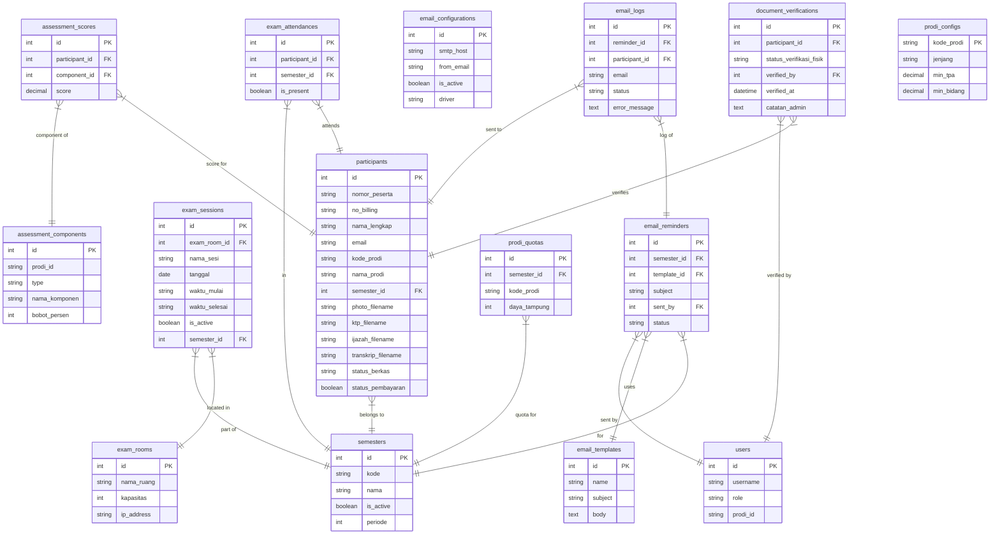

# Database Documentation

## ER Diagram

## Tables Overview

### Core Tables
- **`users`**: Administrators and operators.
- **`settings`**: Key-value store for application configuration.
- **`semesters`**: Academic periods (e.g., "20241").

### Participant Data
- **`participants`**: Main table for applicant data, including personal info, previous education, document filenames, and statuses.
- **`document_verifications`**: Physical document verification status and checklists.

### Examination (CAT)
- **`exam_rooms`**: Physical rooms/labs for exams.
- **`exam_sessions`**: Scheduled exam sessions in specific rooms.
- **`exam_attendances`**: Records participant attendance in exams.

### Assessment (Grading)
- **`assessment_components`**: Defined scoring components per program study (TPA, Interview, etc.).
- **`assessment_scores`**: Actual scores for each participant per component.
- **`prodi_configs`**: Passing grade thresholds per program study.
- **`prodi_quotas`**: Capacity (daya tampung) per program study per semester.

### Email System
- **`email_configurations`**: SMTP and driver settings.
- **`email_templates`**: HTML email templates.
- **`email_reminders`**: Bulk email campaigns/reminders.
- **`email_logs`**: Detailed delivery logs for each recipient.

### System
- **`update_logs`**: Records of system updates and migrations.
